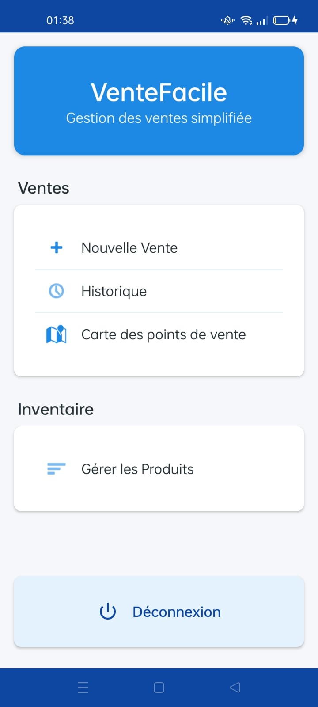
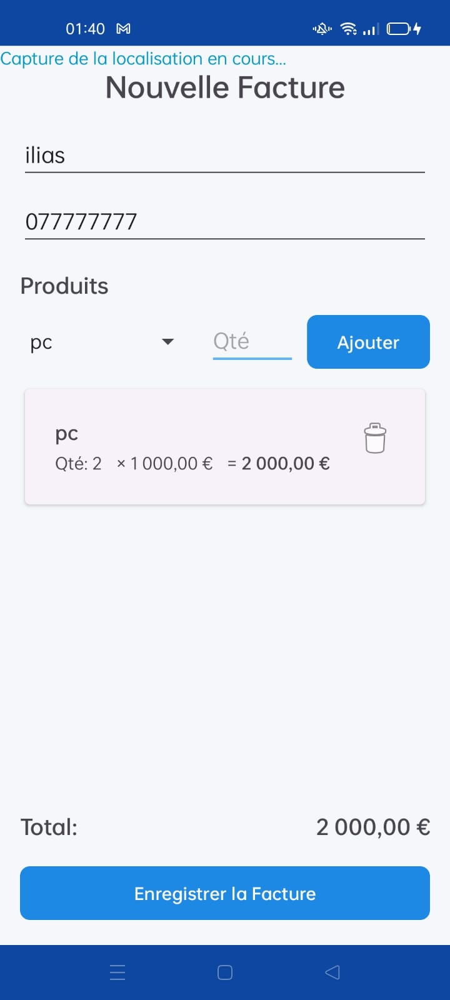
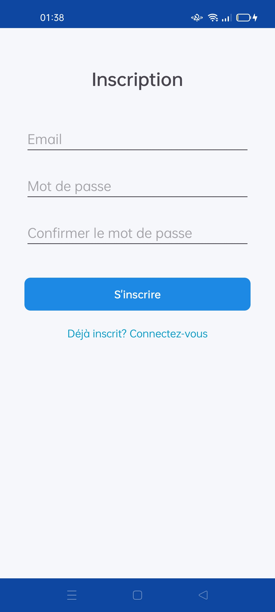
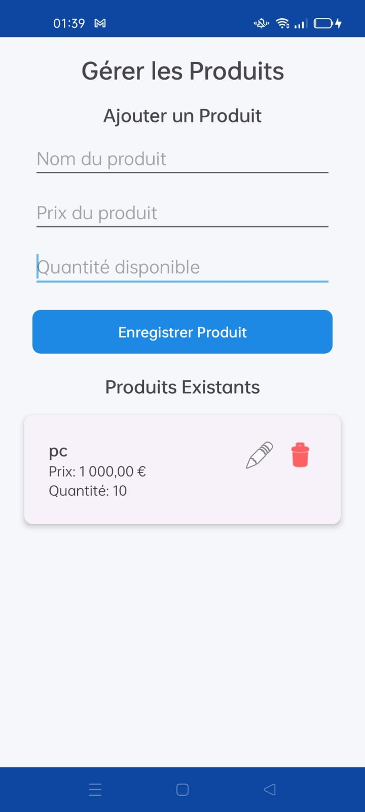
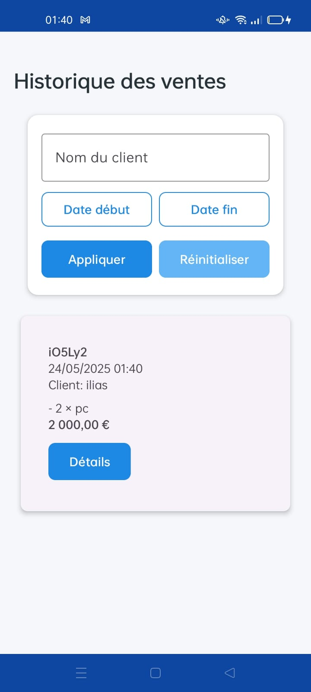

# VenteFacile - Application de Gestion des Ventes Android 📱



Une application Android pour les commerçants, développée en Java, permettant de gérer les ventes, les clients, et les produits avec synchronisation en temps réel via Firebase.

## Fonctionnalités Clés 🚀
- 🔒 Authentification sécurisée (email/mot de passe)
- 📍 Capture automatique de la géolocalisation du client
- 🛒 Gestion des produits et des commandes
- 💸 Calcul automatique des totaux de ventes
- 📊 Historique des ventes avec filtrage par date/client
- ☁️ Synchronisation Firebase Realtime Database

## Captures d'Écran 📸

| Écran de Connexion | Création de Commande | Géolocalisation |
|---------------------|-----------------------|------------------|
|  |  |  |

| Inscription | Gestion des Produits | Historique |
|--------------|-----------------------|-------------|
|  |  |  |

## Technologies Utilisées 🛠️
- **Langage** : Java
- **Base de données** : Firebase Realtime Database
- **Authentification** : Firebase Auth
- **Géolocalisation** : FusedLocationProvider API (Google Play Services)
- **Architecture** : MVVM/MVC

## Configuration Requise ⚙️
- Android SDK 21+
- Android Studio (version récente)
- Compte Firebase avec fichier `google-services.json`

## Installation 🛠️
1. Cloner le dépôt :
   ```bash
   [https://github.com/x3lach/Android-Project-VendeFacile.git](https://github.com/x3lach/Android-Project-VendeFacile.git)
